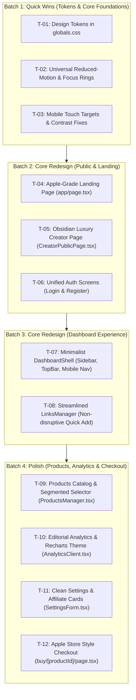

# Phase 2: Prioritized Implementation Task Plan

**Orchestrator Plan:** UI/UX Overhaul for CreatorLink India  
**Execution Mode:** Small, testable batches with automated build and lint validation after each batch.  
**Branch Strategy:** Dedicated git branch `ui-overhaul` with atomic commits per batch.  
**Scope Guard:** Pure UI/UX enhancement. Zero modifications to database schemas, Next.js route structures, API endpoints, Razorpay logic, or authentication JWT mechanics.

---

## 1. Plan Overview & Batch Grouping

---

## 2. Detailed Task Breakdown

### Group A: Quick Wins (Foundation, Accessibility, Tokens)

#### Task T-01: Design Token System & Global Styles
- **Category:** Quick Wins
- **Target Files:** `app/globals.css`
- **Linked Findings:** F-01, F-11, F-14
- **Scope & Changes:**
  - Define CSS custom properties for neutral surfaces, typography scale, 8px spatial grid, radii, elevation shadows, and Apple spring easings.
  - Remove arbitrary hardcoded hex gradients and replace with semantic variables.
  - Refine utility classes (`.btn-primary`, `.btn-ghost`, `.card-hover`, `.input-field`, `.glass`).
- **Acceptance Criteria:**
  - `globals.css` compiles cleanly with Tailwind CSS v4.
  - All standard buttons, inputs, and cards inherit standardized tokens.

#### Task T-02: Universal Reduced-Motion & Focus States
- **Category:** Quick Wins
- **Target Files:** `app/globals.css`, `app/layout.tsx`
- **Linked Findings:** F-02, F-04
- **Scope & Changes:**
  - Add comprehensive `@media (prefers-reduced-motion: reduce)` block neutralizing all CSS animations and transitions for sensitive users.
  - Add universal `:focus-visible` styling (`outline: 2px solid #111111; outline-offset: 2px;`).
  - Darken secondary text colors across utilities to ensure WCAG AA contrast >= 4.5:1.
- **Acceptance Criteria:**
  - Enabling "prefers-reduced-motion" in browser immediately disables marquee and pulse animations.
  - Keyboard tabbing displays a crisp, high-visibility focus outline on all interactive controls.

#### Task T-03: Mobile Touch Targets Hardening
- **Category:** Quick Wins
- **Target Files:** `components/LinksManager.tsx`, `components/CreatorPublicPage.tsx`, `components/DashboardShell.tsx`
- **Linked Findings:** F-03
- **Scope & Changes:**
  - Expand hit areas of link reorder arrows (`↑`, `↓`) and delete buttons to minimum 44px × 44px.
  - Expand language toggle pills and WhatsApp share buttons to minimum 44px tap heights.
- **Acceptance Criteria:**
  - Zero interactive elements have hit areas under 44px on mobile viewports.

---

### Group B: Core Redesign (Public Facing & Onboarding)

#### Task T-04: Apple-Grade Editorial Landing Page
- **Category:** Core Redesign
- **Target Files:** `app/page.tsx`
- **Linked Findings:** F-01, F-09, F-10, F-15
- **Scope & Changes:**
  - Redesign Hero section with pure white/neutral canvas, tight `-0.03em` headline typography, and refined titanium/obsidian phone mockup.
  - Replace noisy colored blobs with serene ambient gradients.
  - Restructure Features grid with generous 32px padding, subtle 1px border highlights, and refined monochrome iconography.
  - Standardize CTAs into a single high-contrast pill button ("Get Started Free").
  - Clean up Testimonials marquee with hover/focus pause capability.
- **Acceptance Criteria:**
  - Landing page feels calm, prestigious, and effortless on 375px, 768px, and 1440px.
  - No text overlap or layout shifts during scroll or window resize.

#### Task T-05: Obsidian Minimalist Public Creator Profile
- **Category:** Core Redesign
- **Target Files:** `components/CreatorPublicPage.tsx`, `app/[handle]/page.tsx`
- **Linked Findings:** F-05, F-08, F-15
- **Scope & Changes:**
  - Replace heavy indigo/purple gradient with an Apple-grade deep obsidian backdrop (`#09090b`) with refined frosted glass panels.
  - Upgrade `LinkCard` with crisp 14px typography, subtle network tag pills, and clean price display.
  - Redesign WhatsApp profile share into a refined floating action pill.
  - Ensure high-contrast language selector buttons with 44px touch targets.
- **Acceptance Criteria:**
  - Public creator page looks like a bespoke luxury creator portfolio.
  - Fast, fluid interaction at 60fps on mobile touch devices.

#### Task T-06: Unified Frictionless Auth Screens (Login & Register)
- **Category:** Core Redesign
- **Target Files:** `app/login/page.tsx`, `app/register/page.tsx`
- **Linked Findings:** F-13, F-04
- **Scope & Changes:**
  - Convert 2-step registration wizard into a single, high-velocity onboarding form with real-time handle preview and password strength gauge.
  - Add password reveal toggle (eye icon) to both Login and Register forms.
  - Replace oversaturated left marketing panel with an editorial dark/neutral showcase with generous whitespace and refined creator quote.
  - Style input fields with clean `#f5f5f7` wells and 1px precision focus borders.
- **Acceptance Criteria:**
  - Registration can be completed effortlessly in a single focused view.
  - Error messages render with accessible `role="alert"` announcements.

---

### Group C: Core Redesign (Dashboard & Link Management)

#### Task T-07: Minimalist DashboardShell
- **Category:** Core Redesign
- **Target Files:** `components/DashboardShell.tsx`, `app/dashboard/layout.tsx`
- **Linked Findings:** F-10, F-14
- **Scope & Changes:**
  - Deduplicate redundant "View Page" links into a single, elegant "Preview Live Page ↗" button in the top navigation bar.
  - Restyle desktop Sidebar with quiet neutral pill active states (`bg-neutral-100 font-semibold`) and clean spacing.
  - Refine mobile BottomNav with smooth pill indicator and 44px touch targets.
  - Rebuild TopBar with frosted glass (`backdrop-blur-md bg-white/80`).
- **Acceptance Criteria:**
  - Sidebar and TopBar look cohesive, modern, and uncluttered.
  - Seamless navigation between Links, Analytics, Products, and Settings without layout jumps.

#### Task T-08: Streamlined LinksManager
- **Category:** Core Redesign
- **Target Files:** `components/LinksManager.tsx`
- **Linked Findings:** F-03, F-06, F-14
- **Scope & Changes:**
  - Replace disruptive inline form expansion with an elegant, non-disruptive quick-add input at the top of the list.
  - Simplify Link Cards: clean typography, elegant network chip, clear click counter, and quiet contextual action tray.
  - Enhance reorder buttons with 44px hit targets and smooth visual feedback.
  - Refine empty state into an inviting prompt with 1-click sample suggestions.
- **Acceptance Criteria:**
  - Adding a link does not abruptly push content or disorient the creator.
  - Visual hierarchy prioritizes link title, price, and performance metrics.

---

### Group D: Polish (Products, Analytics, Settings & Checkout)

#### Task T-09: Products Catalog & Segmented Selector
- **Category:** Polish
- **Target Files:** `components/ProductsManager.tsx`
- **Linked Findings:** F-07, F-14
- **Scope & Changes:**
  - Replace clunky delivery type buttons with an Apple-style segmented control ("Digital Download" vs "1:1 Consultation").
  - Redesign product cards with clean status indicators (Razorpay active badge, sale count) and subtle card elevation.
  - Improve INR currency formatting and input helpers.
- **Acceptance Criteria:**
  - Product creation is intuitive and error-resistant.
  - Cards render cleanly across mobile and desktop.

#### Task T-10: Editorial Analytics & Recharts Theme
- **Category:** Polish
- **Target Files:** `components/AnalyticsClient.tsx`
- **Linked Findings:** F-12, F-14
- **Scope & Changes:**
  - Redesign Stat Cards with bold 32px metrics and muted labels.
  - Harmonize Recharts BarChart palette: replace jarring multi-color bars with elegant monochromatic or refined indigo-to-violet gradient bars.
  - Restyle custom Recharts tooltip with frosted glass and 12px precision typography.
  - Refine Link Performance table with clean progress bars and subtle hover rows.
- **Acceptance Criteria:**
  - Analytics dashboard looks like an Apple Health or Stripe-tier financial dashboard.

#### Task T-11: Clean Settings & Affiliate Identity Cards
- **Category:** Polish
- **Target Files:** `components/SettingsForm.tsx`
- **Linked Findings:** F-04, F-14
- **Scope & Changes:**
  - Restructure affiliate input fields into clean, branded cards with official platform badges (Amazon Associates, Flipkart Affiliate, Myntra Partner).
  - Add auto-save feedback or sleek floating save bar.
  - Refine Language multi-select chips with clean checkmark animations.
- **Acceptance Criteria:**
  - Settings page feels structured, reassuring, and effortless to update.

#### Task T-12: Apple Store Style Digital Product Checkout
- **Category:** Polish
- **Target Files:** `app/[handle]/buy/[productId]/page.tsx`
- **Linked Findings:** F-07
- **Scope & Changes:**
  - Overhaul bare checkout fallback screen into a premium Apple Store style order preview card.
  - Add product delivery type icon, description, instant delivery guarantee badge, and secure payment indicator (Razorpay / UPI / Cards).
  - Provide a clear, stylish "← Return to Profile" button.
- **Acceptance Criteria:**
  - Checkout page builds confidence and maintains high visual trust even in test mode.

---

## 3. Implementation Batching Schedule

| Batch | Scope | Tasks | Files Modified | Verification Check |
|:---:|---|:---:|---|---|
| **Batch 1** | Foundation & Tokens | T-01, T-02, T-03 | `globals.css`, `layout.tsx` | `npm run build && npm run lint`, verify reduced-motion & focus |
| **Batch 2** | Public & Auth | T-04, T-05, T-06 | `page.tsx`, `CreatorPublicPage.tsx`, `login/page.tsx`, `register/page.tsx` | Viewport testing (375/768/1440px), register/login flow verification |
| **Batch 3** | Dashboard Experience | T-07, T-08 | `DashboardShell.tsx`, `LinksManager.tsx` | Navigation check, link add & reorder testing |
| **Batch 4** | Polish & Checkout | T-09, T-10, T-11, T-12 | `ProductsManager.tsx`, `AnalyticsClient.tsx`, `SettingsForm.tsx`, `buy/[productId]/page.tsx` | Product creation, Recharts responsiveness, checkout verification |

---

**Phase 2 Status: COMPLETE.**  
Awaiting user confirmation (**"APPROVED"**) or adjustments to task order/scope before starting **Phase 3: Implementation**.
